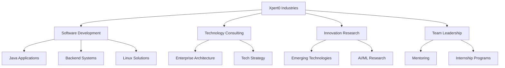

# 👋 Hi, I'm Archisman Kar | Founder & CEO @ Xpert0 Industries

**🚀 Building the Future of Technology | 💡 Innovation Leader | 🌟 Entrepreneur**

---

## 💫 About Me

🎯 **Founder & CEO** of **[Xpert0 Industries](https://xpert0.in)** - Leading a technology company focused on innovation and excellence  
🔭 **Currently Working On**: Scaling Xpert0 Industries and developing cutting-edge technology solutions  
🌱 **Learning**: Advanced Java development, AI/ML technologies, and enterprise architecture  
👯 **Collaboration**: Open to partnerships in Java, C/C++, Android development, Linux systems, and Backend technologies  
🤝 **Seeking Help With**: Frontend development and UI/UX design  
🎓 **Offering**: **Unpaid internships** at Xpert0 Industries for passionate developers and tech enthusiasts  
💡 **Mission**: Transforming ideas into innovative technological solutions

### 🏢 Xpert0 Industries
- **Official Website**: [xpert0.in](https://xpert0.in)
- **GitHub Organization**: [@Xpert0-Industries](https://github.com/Xpert0-Industries)
- **Industry**: Technology & Software Development
- **Focus**: Innovation, Software Solutions, and Tech Consulting

### 🚀 Internship Opportunities
**Join Xpert0 Industries!** We're offering unpaid internships for motivated individuals who want to gain real-world experience in:
- Software Development
- Project Management
- Technology Research
- Product Development

**Contact**: [0@dev.xpert0.in](mailto:0@dev.xpert0.in) for internship applications

---

## 🌐 Connect With Me

---

## 💻 Technology Stack & Skills

### Programming Languages

### Development Tools & Platforms

### Cloud & Infrastructure

### Design & Documentation

### Hardware & IoT

---

## 📊 GitHub Analytics & Performance

---

## 🏆 Achievements & Recognition

### 🔝 Top Contributed Repositories

### ✍️ Daily Developer Inspiration

---

## 📈 Professional Focus Areas

---

## 🎯 Current Projects & Goals

- 🚀 **Scaling Xpert0 Industries**: Building innovative technology solutions
- 📚 **Learning & Development**: Advancing in Java, AI/ML, and enterprise technologies
- 🤝 **Community Building**: Growing the Xpert0 Industries developer community
- 🎓 **Education**: Offering internship opportunities to upcoming developers
- 🌐 **Open Source**: Contributing to and maintaining open-source projects

---

## 💰 Support & Donations

If you find my work valuable and want to support Xpert0 Industries' mission of innovation and education:

---

## 📞 Let's Connect & Collaborate

**Ready to innovate together?** Whether you're looking for:
- 🏢 **Business partnerships** with Xpert0 Industries
- 🎓 **Internship opportunities** 
- 🤝 **Technical collaboration**
- 💡 **Project consultation**

**Reach out**: [0@dev.xpert0.in](mailto:0@dev.xpert0.in) | [xpert0.in](https://xpert0.in)

---

**"Innovation distinguishes between a leader and a follower."** - Steve Jobs

*Building tomorrow's technology today at [Xpert0 Industries](https://github.com/Xpert0-Industries)*

